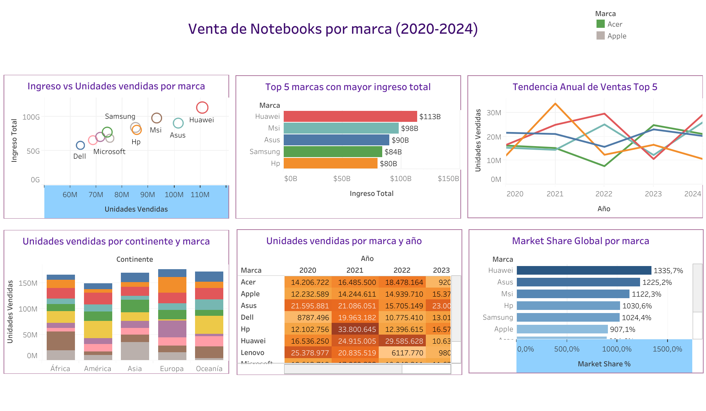

# 💻 **Análisis Global de Ventas de Notebooks (2020–2024)**

Este proyecto implementa un **pipeline de datos end-to-end en AWS**, aplicando una arquitectura tipo **Data Lakehouse (Bronze → Silver → Gold)**.  
Integra **Python (ETL + EDA)**, **Amazon S3 (almacenamiento)**, **Athena (consultas SQL)** y **Tableau Public (visualización interactiva)**.

---

## 🎯 **Objetivo del Proyecto**

Analizar el comportamiento global del mercado de notebooks entre **2020 y 2024**, identificando:

- 📈 **Tendencias anuales por marca**  
- 🏆 **Top marcas por ingresos y unidades**  
- 🌍 **Distribución geográfica de ventas**  
- 🧩 **Estrategias de mercado basadas en precios y volúmenes**

---

## 🧠 **Arquitectura General**


**Flujo del pipeline:**
Dataset CSV → AWS S3 (Bronze)
↓
Python (Limpieza, ETL y EDA) → S3 (Silver)
↓
Athena (Tablas externas SQL) → S3 (Gold)
↓
Tableau Public (Visualización)


---

## ☁️ **1. Creación del Bucket S3**

📦 **Bucket:** `notebooks-datalake-oalvarez`

**Estructura de carpetas:**

| Capa | Propósito | Ejemplo de ruta |
|------|------------|-----------------|
| 🟤 **Bronze** | Datos crudos (CSV original) | `bronze/notebooks_ventas.csv` |
| ⚪ **Silver** | Datos limpios y transformados | `silver/notebooks_ventas_clean.csv` |
| 🟡 **Gold** | KPIs y agregaciones finales | `gold/market_share_por_marca/data.parquet` |

---

## 🧱 **2. Capa Bronze → Silver (ETL de Limpieza)**

📄 **Archivo:** `ETL/limpieza_transformacion.ipynb`

### 🔹 **Descripción**

Esta etapa crea la **capa Silver**, limpiando y normalizando los datos provenientes del dataset crudo (**Bronze**).

**Pasos realizados:**

1. Conexión con **AWS S3** usando `boto3`.  
2. Lectura del **CSV original** desde la carpeta `bronze/`.  
3. **Limpieza de datos:**
   - Eliminación de duplicados y nulos.  
   - Tipificación correcta de columnas (`int`, `float`, `string`).  
   - Normalización de texto (`title()`, `strip()`).  
4. **Exportación del dataset limpio** a `silver/notebooks_ventas_clean.csv`.

**Resultado:**  
✅ Dataset limpio disponible en la **capa Silver**.

---

## 🔍 **3. Análisis Exploratorio de Datos (EDA)**

📄 **Archivo:** `EDA/eda_ventas_completo.ipynb`

### 🔹 **Objetivo**

Analizar la calidad, consistencia y patrones de los datos antes de generar los KPIs.

---

### 🧾 **3.1 Calidad de datos**

- Mapa de valores nulos (no se detectaron).  
- Eliminación de duplicados.  
- Evaluación de outliers con boxplots e IQR (sin valores atípicos significativos).

---

### 📊 **3.2 Análisis descriptivo**

**Gráficos generados con Matplotlib y Seaborn:**

| Gráfico | Objetivo | Descripción |
|----------|-----------|-------------|
| 📊 **Market Share** | Analizar participación de mercado por marca | Huawei lidera con más del **13%** global. |
| 📈 **Tendencia anual (Top 5)** | Ver evolución de ventas 2020–2024 | Huawei y MSI crecen sostenidamente. |
| 🌍 **Ventas por continente** | Identificar desempeño geográfico | América y Europa concentran la mayoría. |
| 💰 **Ingreso vs Unidades** | Analizar relación entre volumen y rentabilidad | Estrategias **premium vs. volumen**. |
| 🏆 **Top 5 por ingresos** | Ranking global de ingresos acumulados | Huawei, MSI y Asus dominan. |
| 🔥 **Heatmap** | Evolución anual por marca | Años 2021–2022 fueron los más fuertes. |

---

### 💡 **3.3 Hallazgos clave**

- El mercado es **oligopólico** (pocas marcas concentran las ventas).  
- **Huawei** domina tanto en unidades como en ingresos.  
- **2021 y 2022** fueron los años de mayor rendimiento.  
- No hay outliers estadísticos, pero sí **dispersión real** por estrategia.

---

## 🥇 **4. Capa Gold (KPIs y Tablas Finales)**

📄 **Archivo:** `ETL/etl_gold.ipynb`

### 🔹 **Descripción**

Genera los **datasets analíticos finales (KPIs)** y los exporta en formato **Parquet** a la capa **Gold**.

**KPIs generados:**

1. **Market Share por Marca**  
2. **Tendencia Anual Top 5 Marcas**  
3. **Unidades por Continente y Marca**  
4. **Ingreso vs Unidades (con Precio Promedio)**  
5. **Top 5 Marcas por Ingreso Total**

---

### 🧩 **Exportación idempotente a S3**

Los archivos se exportaron como `.parquet` (compactos y óptimos para Athena).

Ejemplo:

s3://notebooks-datalake-oalvarez/gold/market_share_por_marca/data.parquet


Además, el notebook descarga automáticamente los CSV a la carpeta local **Output/** para usarlos en **Tableau Public**.

---

## 🧮 **5. Consultas SQL en AWS Athena**

📁 **Capa Gold SQL Scripts:**

| Archivo | Descripción |
|----------|-------------|
| `01_market_share_por_marca.sql` | Calcula la participación de mercado por marca |
| `02_tendencia_anual_top5_marcas.sql` | Muestra la evolución de ventas de las Top 5 marcas |
| `03_unidades_por_continente_y_marca.sql` | Compara ventas entre continentes |
| `04_ingreso_vs_unidades_con_precio_promedio.sql` | Evalúa ingresos, unidades y precios promedio |
| `05_top5_marcas_por_ingreso_total.sql` | Ranking de marcas por facturación total |

**Ejemplo de creación de tabla externa:**

```sql
CREATE EXTERNAL TABLE IF NOT EXISTS notebooks_gold_db.market_share_por_marca (
  marca STRING,
  unidades_vendidas BIGINT,
  market_share DOUBLE
)
STORED AS PARQUET
LOCATION 's3://notebooks-datalake-oalvarez/gold/market_share_por_marca/';

```
---
## 📊 6. Visualización Interactiva en Tableau Public

📍 Dashboard:
🔗 Ver en Tableau Public



Vistas incluidas:

 - Market Share Global por Marca
 - Tendencia Anual Top 5 Marcas
 - Unidades por Continente y Marca
 - Ingreso vs Unidades Vendidas
 - Top 5 Marcas por Ingreso
 - Heatmap de Ventas (Marca vs Año)

Diseño:

 - Colores coherentes entre vistas (Huawei rojo, MSI celeste, Asus azul, HP gris, Samsung amarillo).
 - Etiquetas internas para unidades vendidas.
 - Dashboards ajustados para Tableau Public (sin conexión directa a AWS).

---

##📎 7. Conclusiones Finales

- Huawei lidera el mercado tanto en unidades como en ingresos totales.

- MSI y Asus se consolidan como competidores cercanos.

- Las diferencias regionales explican parte del rendimiento: Europa y América dominan.

- El pricing premium es clave para rentabilidad (no solo volumen).

El pipeline demostró la integración exitosa entre Python, AWS S3, Athena y Tableau, garantizando reproducibilidad y escalabilidad.

---

## 🚀 8. Stack Tecnológico
| Componente      | Tecnología                               |
| --------------- | ---------------------------------------- |
| Almacenamiento  | **Amazon S3**                            |
| Procesamiento   | **Python (Pandas, Boto3, PyArrow)**      |
| SQL Engine      | **Amazon Athena**                        |
| Visualización   | **Tableau Public**                       |
| Infraestructura | **AWS Cloud**                            |
| Dataset         | **CSV 2020–2024 (notebooks_ventas.csv)** |

---

✅ Autor

👤 Octavio Alvarez
📧 LinkedIn

📁 Repositorio en GitHub
